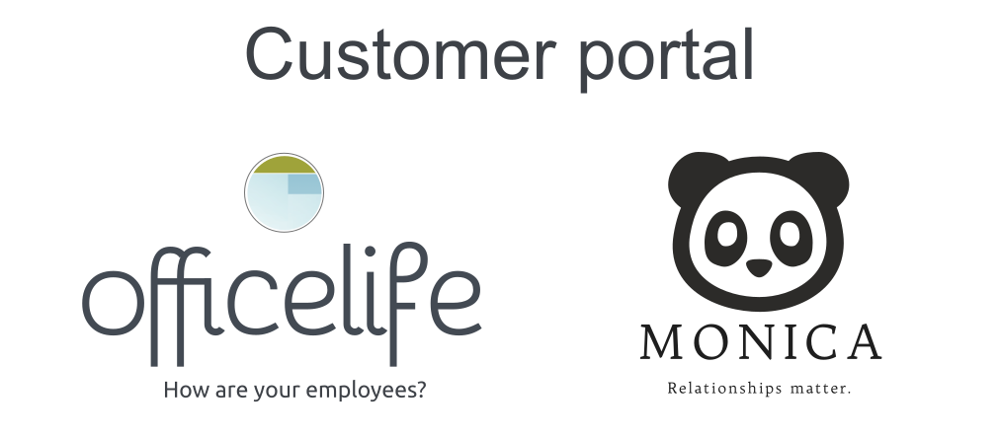

<div align="center">
    
</div>

## ❓ About

This is the customer portal for both [Monica](https://monicahq.com) and [OfficeLife](https://officelife.io), both open source web applications.

It allows customers to purchase a license that will let them use Monica and/or OfficeLife in production on the instance that we, the Monica organization, operates. This license is a product key that users must add to their accounts in order to use the product.

But first, let's answer some questions.

### Why is this not part of the main Monica/OfficeLife codebase?

Monica and OfficeLife are open source and can be freely used by anyone who is crazy enough to setup, store and maintain a custom instance. For those who take this approach, it doesn't make sense to have any information about subscriptions, purchasing information,… in the same codebase as the main application.

Moreover, even if this customer portal doesn't store any credit card information, data in this portal are not stored in the same databases used by Monica and OfficeLife, reducing the risk in case of data breaches.

### Why publish this code? People will be able to easily pirate this.

Yes. Of course, by publishing this code, it's easier to crack the key that we require to use an account. But users and companies who want to screw us will do it anyway. So, we trust that people will play the game and pay for the product so we can continue to improve it and make it a sustainable company.

### How does that work?

Each account of Monica and OfficeLife needs a valid key to work. The key is an encrypted array that contains the following information:

* `validated until date`: the date the key remains valid until,
* the purchased plan,
* the email address of the person who made the purchase.

The key is a JSON that is encrypted with a key that we, and only we, possess. Once the key is created, customers simply have to copy and paste the encrypted key to their accounts to validate it.

Every day, on either Monica or OfficeLife, we will check if we need to revalidate a key, depending on the frequency of the subscription - they can be either monthly or annual.

This check is a ping that originates from an OfficeLife or Monica instance, which will reach this customer portal. Obviously, no private information is ever exchanged during this check. This ping either replies with a HTTP 200 or HTTP 500, depending on the validity of the key.

## 📦 Installation

Honestly, there shouldn't be any reason why you would want to host this portal yourself. That being said, the project requires PHP 8.0 or higher, and [everything that Laravel requires](https://laravel.com/docs/9.x/deployment#server-requirements):

* HTTP server with PHP support (eg: Apache, Nginx, Caddy)
* Composer
* MySQL

We do not support Postgre or SQLite.

You should clone this repository and run a few commands to get started:

```bash
composer install
yarn install
yarn prod
```

Then you have to populate the .env file with your own setup. This file contains all the variables needed to run the software.

```bash
cp .env.example .env
php artisan key:generate
```

Finally, you have to populate your database by running migrations.

```bash
php artisan migrate
```

## 📦 Local installation

### Paddle

If you want to test the portal locally, you need to create an account on https://sandbox-vendors.paddle.com/.

Then, update the following .env variables that you will find in your account:

- `PADDLE_VENDOR_ID`
- `PADDLE_VENDOR_AUTH_CODE`
- `PADDLE_PUBLIC_KEY`

Now, to test the different webhooks, you need to listen to them. However, you are on local, so by default Paddle won't know how to reach you. Therefore, you need to create a tunnel between your local computer and Paddle. You can use https://expose.dev/ for this. They provide a free account.

Once you have your Expose account, go to https://sandbox-vendors.paddle.com/alerts-webhooks to configure your tunnel.

Launch `expose share https://customers.test` from your terminal, and now your local application will be able to receive webhooks from Paddle.

### Monica and OfficeLife integration

To connect the API with Monica and/or OfficeLife, you need to generate API keys.

This is done with Laravel Passport. Just generate the client keys with:

```bash
php artisan passport:keys
php artisan passport:client --client
```

Note the client ID and secret, they will be required to setup Monica or OfficeLife.

### Feeding seed data to test

You need to populate the database with products that are defined on Paddle.

1. Create a product on Paddle (in the sandbox), and copy the plan id.
2. Look up for the `plans` table in your own database.
3. Populate the fields:
   1. `product`: it's gonna be either `Monica` or `OfficeLife`.
   2. `friendly_name`: the marketing name of the plan, like `Yearly plan`
   3. `description`: a nice marketing description to add more information
   4. `plan_name`: the name of the plan
   5. `plan_id_on_paddle`: here, paste your plan id from Paddle
   6. `price`: price. For 10$, write 10.
   7. `frequency`: either `Annual` or `Monthly`.

SQL query to autopopulate the table:

```sql
INSERT INTO `plans` (`id`, `product`, `friendly_name`, `description`, `plan_name`, `plan_id_on_paddle`, `price`, `frequency`, `created_at`, `updated_at`) VALUES
(1, 'Monica', 'Monthly plan', 'Unlimited contacts', 'Personal plan - One user ', '24749', 9, 'Monthly', NULL, NULL);
```

## 🏷️ Versioning

We follow [SemVer](http://semver.org/) closely. Minor and patch releases should not introduce breaking changes to the codebase.

## 🛠️ Support

We don't support this codebase other than for our own needs. Again, you should not need this repository at all.

## 👷‍♀️ Contributing

Thanks for considering contributing to this project.

Contributions to this software are welcome, especially ones that:

* improve security,
* improve performance,
* improve wording.

We do not welcome pull requests that will change the nature of this portal.

## 🧪 Testing

Most of our codebase is unit tested. Every pull request should be tested. To run the tests:

```bash
vendor/bin/phpunit
```

## 👥 Credits & acknowledgements

* [Regis Freyd (djaiss)](https://github.com/djaiss)
* [Alexis Saettler (asbiin)](https://github.com/asbiin)
